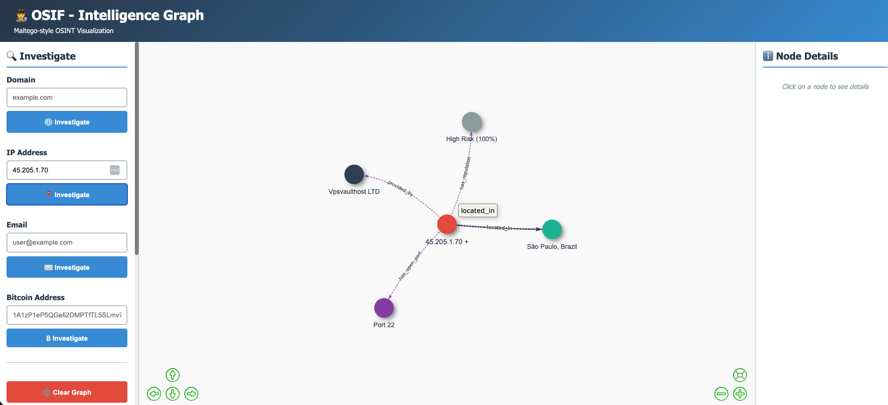
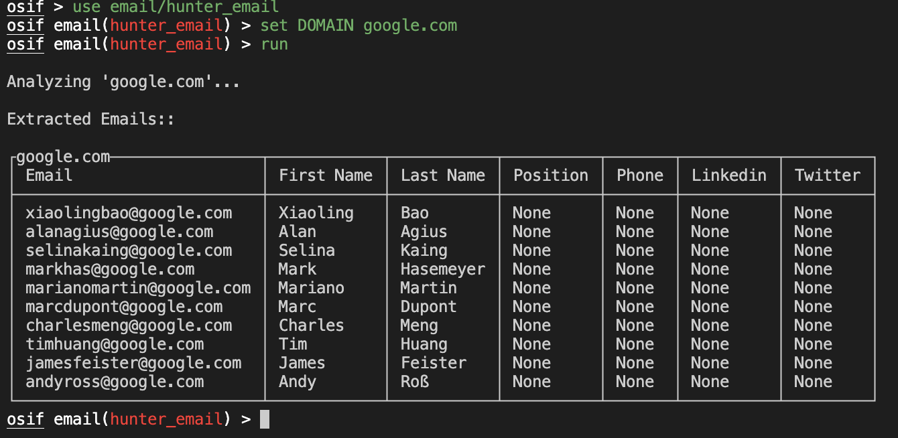
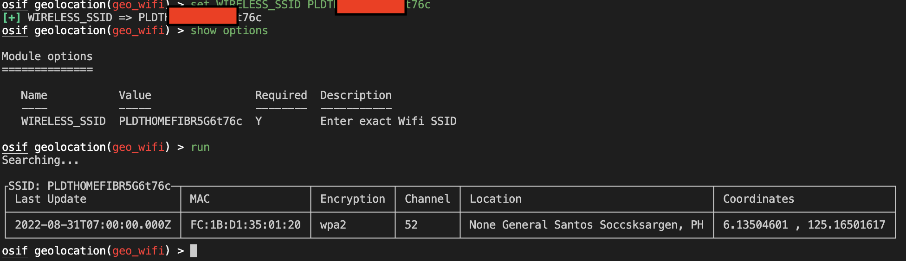
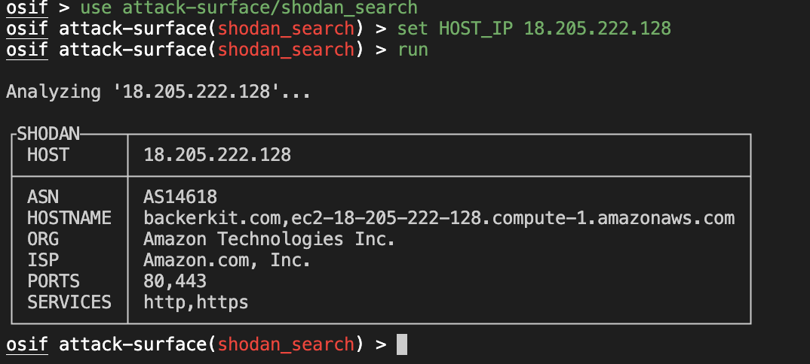

# OSIF

[](https://osif.laet4x.com/)
[](https://github.com/fr4nc1stein/osint-framework/blob/main/LICENSE.md)

Opensource Intelligence Framework is an open-source framework dedicated to OSINT. For the ease of use, the interface has a layout that looks like Metasploit.

**🆕 NEW: Web-based Graph Visualization** - Now includes a Maltego-style web interface for visual OSINT investigations!

It consists of various modules that aid osint operations:

1. Attack Surface
1. Blockchain
1. Email
1. Host Enumeration
1. IoC
1. Mobile
1. Social Media
1. Web Enumeration

# Features

## 🖥️ Command Line Interface
Traditional Metasploit-style CLI for running OSINT modules

## 🌐 Web Graph Interface (NEW!)
- **Visual Investigation**: Maltego-style graph visualization
- **Interactive Exploration**: Click nodes to see details, double-click to investigate further
- **Multiple Entry Points**: Investigate domains, IPs, emails, Bitcoin addresses
- **Automatic Entity Linking**: Automatically discovers and links related entities
- **Export Capabilities**: Export investigation graphs as JSON
- **Real-time Updates**: Watch your investigation graph grow in real-time

# Screenshots

### 🎯 Web Graph Visualization

The new web interface provides a visual, interactive way to conduct OSINT investigations:



- Investigate domains, IPs, emails, and cryptocurrency addresses
- Automatically discover related entities
- Visual representation of relationships
- Export and share investigation data

### Email Hunter (Hunter.io & Tomba)



- **Hunter.io**: Professional email finder and verifier
- **Tomba**: Advanced email finder with verification and enrichment
- **Combined Search**: Use both services for comprehensive email discovery

### GeoWifi Hunter



### Shodan Attack Surface



# Documentation

Full documentation found at https://osif.laet4x.com/

# Docker Installation (Recommended)

### Docker installation

Get [Docker](https://docs.docker.com/get-docker/)
for Windows, Linux and MacOS

### Where to get Docker Compose

### Windows and macOS

Docker Compose is included in
[Docker Desktop](https://www.docker.com/products/docker-desktop)
for Windows and macOS.

### Linux

You can download Docker Compose binaries from the
[release page](https://github.com/docker/compose/releases) on this repository.

### Run osif with docker and docker-compose

```
git clone https://github.com/fr4nc1stein/osint-framework osif
cd osif
docker-compose up -d
docker exec -ti osif bash
./osif
```

If not started, follow this instruction below:

```
docker build --no-cache  --tag osif .
docker run -ti osif bash
./osif
```

# Quick Start

## Web Interface (Recommended for Beginners)

```bash
# Clone and install
git clone https://github.com/fr4nc1stein/osint-framework osif
cd osif
pip3 install -r requirements.txt

# Set up API keys (optional but recommended)
cp .env.example .env
# Edit .env with your API keys

# Start web server
chmod +x start_web.sh
./start_web.sh
```

Then open http://localhost:5000 in your browser!

## Command Line Interface

```bash
# Run traditional CLI
./osif
```

# Installation

Recommended on ubuntu or kali

```
git clone https://github.com/fr4nc1stein/osint-framework osif
cd osif
pip3 install -r requirements.txt
```

# Configuration

Create .env

1. Virustotal API https://www.virustotal.com/
1. CENSYS API https://accounts.censys.io/ (under development)
1. ABUSECH https://abuse.ch (required)
1. SHODAN API https://account.shodan.io/
1. HUNTER API https://hunter.io/api-keys
1. BITCOIN ABUSE API https://www.bitcoinabuse.com/
1. WIGEL API https://wigle.net/ (geolocation module)
1. SECURITY TRAIL API https://securitytrails.com/
1. TOMBA API https://tomba.io/

```
VT_API=""
CENSYS_APPID=""
CENSYS_SECRET=""
ABUSECH_API_KEY = ""
SHODAN_API_KEY = ""
HUNTER_API_KEY = ""
BITCOINABUSE_API_KEY = ""
WIGLE_API_NAME = ""
WIGLE_API_TOKEN = ""
SECURITY_TRAIL_API = ""
TOMBA_API_KEY=""
TOMBA_SECRET_KEY=""

# Web Server (optional)
SECRET_KEY="your-secret-key-here"
WEB_PORT=5000
```

# Usage

## Web Interface

Start the web server:
```bash
./start_web.sh
# or
python3 web_server.py
```

Then navigate to http://localhost:5000

### Web Interface Features:
- **Domain Investigation**: Find emails, subdomains, DNS records, technologies
- **IP Investigation**: Geolocation, ISP info, open ports (Shodan), hostnames
- **Email Investigation**: Extract domain and related information
- **Bitcoin Investigation**: Check wallet balance and transaction history
- **Interactive Graph**: Click nodes for details, double-click to investigate further
- **Export**: Save your investigation as JSON

## Command Line Interface

```
─$ ./osif


                                                         ##     ####   #####   ######
                                                        #  #   #    #    #     #
                                                       #    #  #         #     #
                                                       #    #   ####     #     ####
                                                       #    #       #    #     #
                                                        #  #   #    #    #     #
                                                         ##     ####   #####   #


                                                             >> OSINT Framework
                                                                 >> @laet4x


        -=[ 1 api           ]=-
        -=[ 2 dns           ]=-
        -=[ 1 subdomain     ]=-
        -=[ 1 uncategorized ]=-

[!] There are some issues ; use 'show issues' to see more details
osif > use dns/dns_records
osif dns(dns_records) > show options

Module options
==============

   Name    Value       Required  Description
   ----    -----       --------  -----------
   DOMAIN  google.com  Y         Provide your target Domain

osif dns(dns_records) >
```

## If you love OSIF you can buy me a coffee to support this project :)

<a href="https://www.buymeacoffee.com/laet4x" target="_blank"></a>

# Author

laet4x

cadeath
